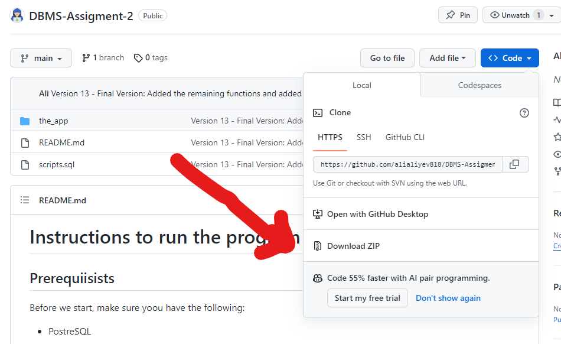
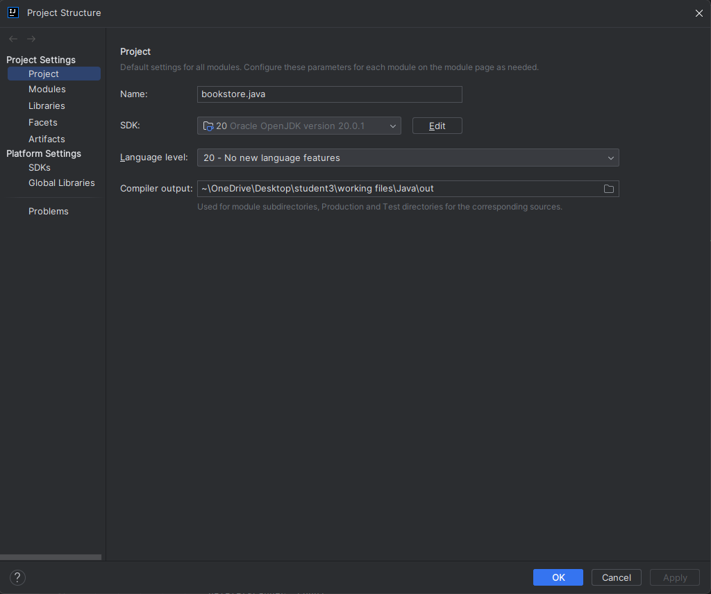
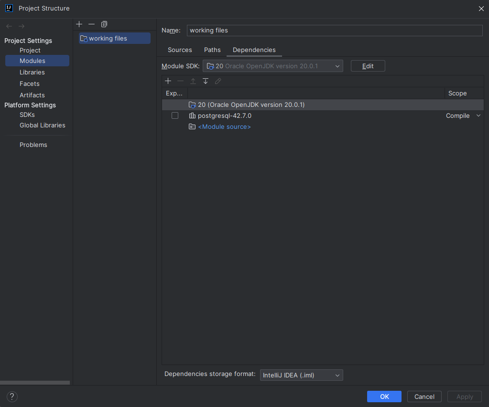
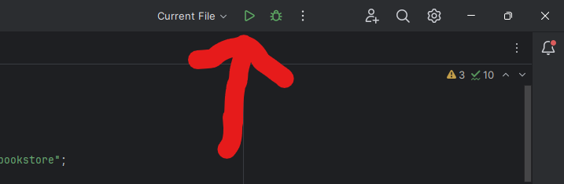
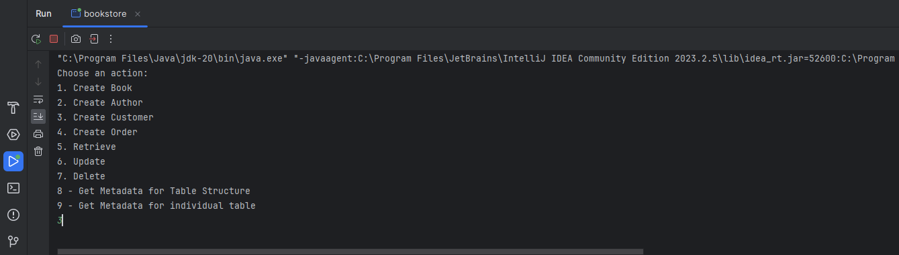

# Instructions to Run the Program

## Prerequisites

Before beginning, ensure you have the following installed:

* PostgreSQL
* IntelliJ IDEA Community Edition
* PostgreSQL JDBC Driver ([Download Here](https://jdbc.postgresql.org/download/))

## Downloading the Repository

1. Visit the GitHub repository at [https://github.com/alialiyev818/Assignment-2](https://github.com/alialiyev818/Assignment-2).
2. Click on the 'Code' button and select 'Download ZIP'.



## Setting Up in IntelliJ IDEA

1. Open the 'the_app' folder in IntelliJ IDEA.
2. Navigate to 'File' > 'Project Structure'.
3. In the 'Project' section, select an SDK version (preferably version 20).
4. Set the language level to match the SDK version (e.g., '20-no new language features'). Avoid preview versions.
5. Click on 'Apply'.



5. Go to 'Modules' > 'Dependencies'. Set the Module SDK to the version chosen earlier.
6. Click the plus icon (+) and select 'JARs or Directories'. Locate and add the PostgreSQL JDBC driver (`postgresql-XX.X.X.jar`).
7. Ensure these elements are in the following order:
   - Oracle OpenJDK version (e.g., 20)
   - postgresql-XX.X.X.jar
   - Module Source
8. At the bottom of this window, ensure the 'Dependencies storage format' is set to IntelliJ IDEA (.iml), then click 'Apply' and 'OK'.



## Creating the Database

1. Create a PostgreSQL database using either the terminal or pgAdmin.
2. Locate the SQL queries in the submitted Word files.
3. Connect to the database and execute the CREATE queries in sequence, either via terminal or pgAdmin's query tool.
4. Note the database name, PostgreSQL username (default 'postgres'), and the password set during installation.

## Setting Up the Code

1. Open the 'bookstore.java' file in the src folder.
2. Replace the placeholders in the following code snippet with your database details:

    ```java
    private static final String DATABASE_URL = "jdbc:postgresql://localhost:5432/your_database_name";
    private static final String DB_USER = "your_username";
    private static final String DB_PASSWORD = "your_password";
    ```

3. Click the green 'Run' button in the top right corner of IntelliJ.



## Using the Program

To use the program, type the number corresponding to the desired function in the console and press 'Enter'. Ensure there are no spaces before or after the number.



# Enjoy the Program!!!